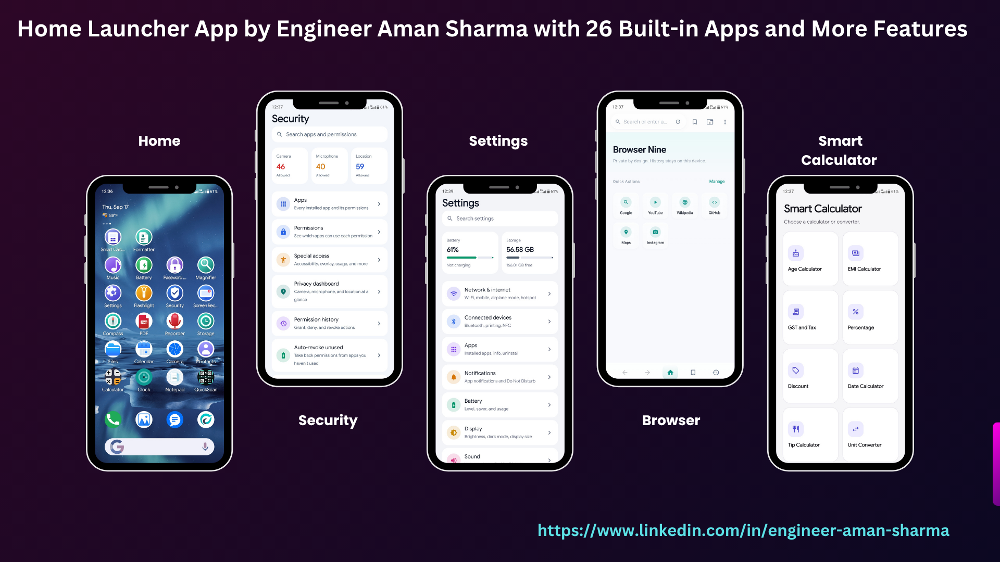
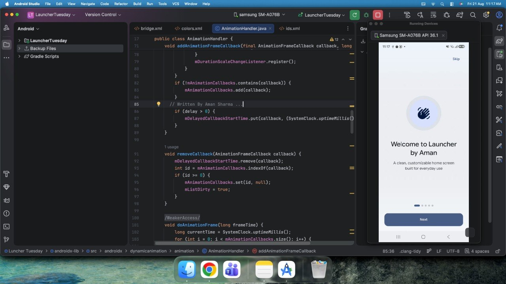

# Launcher Tuesday

A custom Android launcher built with Kotlin and Jetpack Compose, integrating multiple built-in app modules into a single fast and responsive launcher experience.

  

  

## Overview

Launcher Tuesday is more than a traditional launcher. It provides a unified Android experience with multiple client-built application modules integrated directly into the launcher.

The integrated modules include:

- Phone
- Gallery
- Message
- Browser
- Calculator
- Clock
- Notepad
- QuickScan
- Files
- Calendar
- Camera
- Contacts
- Compass
- PDF
- Recorder
- Storage
- Settings
- Flashlight
- Security
- Screen Recorder
- Music
- Battery
- Password Generator
- Magnifier
- Smart Calculator
- Formatter - Text Formatter

These are not separate applications that users need to download individually. The required functionality is bundled into the launcher and available directly from the home screen.

The launcher was designed to remain fast, responsive, and smooth even with multiple application modules integrated into the same project.

## Key Features

- Custom Android launcher experience
- Integrated Phone, Gallery, Message, Browser, Calculator, Clock, Notepad, QuickScan, Files, Calendar, Camera, Contacts, Compass, PDF, Recorder, Storage, Settings, Flashlight, Security, Screen Recorder, Music, Battery, Password Generator, Magnifier, Smart Calculator, and Text Formatter
- Built-in application modules available directly from the launcher home screen
- No separate installation required for integrated modules
- Client-defined app arrangement and launcher behavior
- Fixed/pinned built-in applications according to client requirements
- App drawer for accessing available applications
- Home screen wallpaper support
- Widgets support
- Home screen settings
- Apps list
- Long-press contextual launcher options
- Date and time information on the home screen
- Responsive layouts across different screen sizes
- Smooth navigation between integrated modules
- Fast and responsive user experience
- Modular structure for keeping individual application functionality separated
- Offline functionality for modules that do not require network access

## Engineering Focus

A major part of this project was integrating multiple independently developed application experiences into a single launcher without making the overall application feel heavy or slow.

Each built-in application keeps its own functionality while being integrated into the launcher as a dedicated module. This keeps the features organized while providing users with a unified experience.

The launcher was optimized for:

- Smooth screen transitions
- Responsive user interactions
- Efficient state handling
- Modular feature organization
- Reduced unnecessary work during navigation
- Efficient Compose UI rendering
- Stable performance with multiple integrated modules

Kotlin Coroutines were used where asynchronous work was required, helping keep UI interactions responsive and preventing unnecessary work from blocking the main thread.

## Built With

- Kotlin
- Jetpack Compose
- Material 3
- Android
- Kotlin Coroutines
- Modern Android development tools

## My Role

I designed and developed the launcher experience and integrated the required application modules into a single Android application.

My work included:

- Launcher home screen and navigation
- App drawer experience
- Integration of multiple application modules
- Responsive Compose UI
- Client-specific launcher restrictions and behavior
- Module-level functionality and interactions
- Performance and responsiveness improvements
- UI states and user interactions
- Integration of previously developed application functionality into the launcher

## Project Details

- Package Name: `com.launcher.app5`
- Status: Client Project — UI, features, and availability may change in the future.

## Client Requirements

The launcher was developed for a client with specific requirements around the home screen and integrated applications.

The built-in applications were required to remain available from the launcher and could not be freely removed or rearranged by the user.

Instead of requiring users to install several separate applications, the client wanted a single launcher installation containing the required functionality.

This provided a simpler installation and user experience while keeping the individual application features organized within the project.

## Source Code

This is a client project, so the source code is not publicly available.

The project overview and presentation are shared to demonstrate my Android development, UI engineering, application integration, and performance-focused development experience.

## Developer

**Aman Sharma**

Android Developer | Kotlin | Jetpack Compose | MVVM

[LinkedIn](https://www.linkedin.com/in/engineer-aman-sharma)